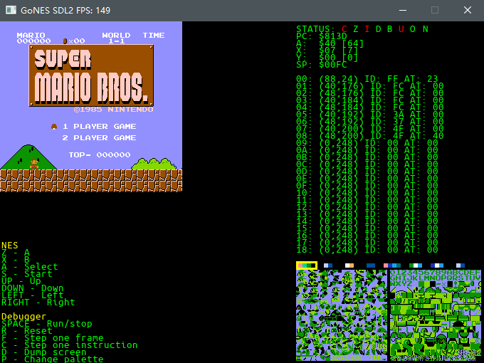

# GoNES
Yet another NES emulator written in Golang.

Currently working in progress.

## Current status:
CPU and PPU are implemented, as well as the mapper 0. Also, controller 0 is implemented.

But no audio support yet.



## Build
```libsdl2```, ```libsdl2-image``` and ```libsdl2-ttf``` are required at present. However, you can install ```libsdl2-mixer``` and ```libsdl2-gfx``` since they may be required in the future development.

Once you have all the libs listed above installed, just simply execute:

```
go build
```

Or you can build statically with:

```
go build -tags static -ldflags "-s -w"
```
This gives you an option to release GoNES without having a brunch of dlls packed along with it.

Statically cross-compile to another OS is also possible, e.g., Linux to Windows:

```
CGO_ENABLED=1 CC=x86_64-w64-mingw32-gcc GOOS=windows GOARCH=amd64 go build -tags static -ldflags "-s -w"
```

Theoretically, you can cross-compile GoNES to OSX with osxcross (and that's indeed what I've tried to do), but rumor has it that the binary is not working properly. I haven't tested the binary since I didn't have a OSX machine. 

## Usage
```
GoNES -file [NES_ROM_file]
```

Reference: http://wiki.nesdev.com/

2020, net2cn